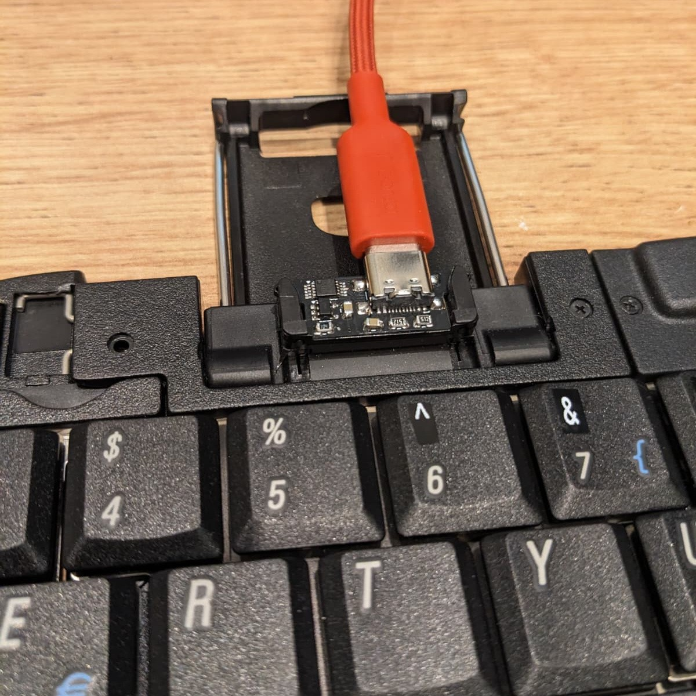

Palm™ Portable Keyboard USB adapter
===================================

Based on CH552 Macropad mini by Stefan Wagner (https://github.com/wagiminator/CH552-Macropad-mini). Headers from the original code:

    // ===================================================================================
    // Project:   MacroPad Mini for CH551, CH552 and CH554
    // Version:   v1.3
    // Year:      2023
    // Author:    Stefan Wagner
    // Github:    https://github.com/wagiminator
    // EasyEDA:   https://easyeda.com/wagiminator
    // License:   http://creativecommons.org/licenses/by-sa/3.0/
    // ===================================================================================

    # Project:   chprog - Programming Tool for CH55x Microcontrollers
    # Version:   v1.1
    # Year:      2022
    # Author:    Stefan Wagner
    # Github:    https://github.com/wagiminator
    # License:   MIT License

Based on Gist by Mightypork (https://gist.github.com/MightyPork/6da26e382a7ad91b5496ee55fdc73db2)

Key mapping compatible with https://github.com/pymo/ppk_bluetooth/

Hardware design released into public domain.
